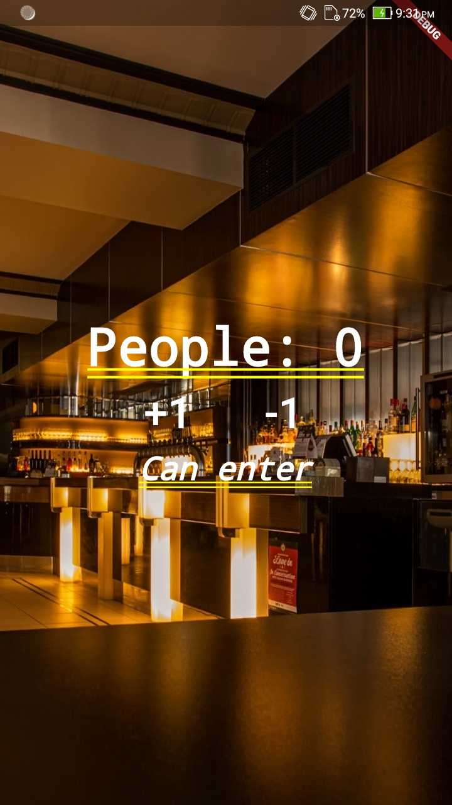

# Repository destined to learn flutter


All the projects inside this repository is just for learning 
proposes of Flutter mobile framework and the Dart language.

To run is easily, just go to the [flutter official website](https://flutter.dev/)
and follow the guidelines for installation on your operational system.

After installed and configured properly you can just can go to the
which app directory you want to test with your mobile connected
on your USB and type ```flutter run```.

And it's done.


### App 1 - Restaurant entrance

- Screenshots




### App 2 - IMC Calculator

- Screenshots


### App 3 - Currency convert


### App 4 - Todo list


### App 5 - Gif finder


